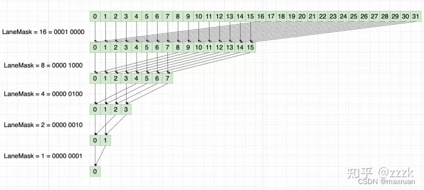

# CUDA的内存组织简介
CPU和GPU中都有内存分级的设计。对于CPU编程来说，CUDA编程模型向程序员提供更多的控制权。因此，对CUDA编程来首，熟悉内存的分级组织是非常重要的。


CUDA 中的内存组织示意图


# CUDA中不同类型的内存
## 1. 全局内存
全局内存(global memory)的含义是核函数中的所有线程都能够访问其中的数据。在向量相加的例子中， d_x, d_y和d_z 都是指向全局内存的。
- 访问速度较慢
- 容量最大，其容量基本就是显存容量
- 使用cudaMalloc 函数为全局内存分配内存。然后在核函数中访问分配的内存，改变其中的数据值。
- 使用cudaMemcpy 将主机的数据复制到全局内存，或者反过来。
    - cudaMemcpy(d_x, h_x, M, cudaMemcpyHostToDevice)
    - cudaMemcpy(d_x, h_x, M, cudaMemcpyDeviceToHost)
    - cudaMemcpy(d_x, h_x, M, cudaMemcpyDeviceToDevice) 

## 2. 常量内存
- 常量内存是有常量缓存的全局内存，数量有限，一共仅有64KB。它的神明周期与全局内存一样。不同的是，常量内存只读不可写。
- 由于有缓存，常量内存的访问速度比全局内存高。但是高访问速度的前提是一个线程束中的线程要读取到相同的常量内存数据。
- 在向量相加的例子中 if(n<N) 中的N就是一个常量内存，可以被每个线程访问。
- 可以通过 *__constant __* 在核函数外面定义变量
- 给核函数传递参数就存放在常量内存中
- 一个核函数中最多只能使用4KB常量内存

## 3. 纹理内存和表面内存
- 纹理内存和表面内存类似于常量内存，也是一种具有缓存的全局内存，有相同的可见范围和生命周期，一般只读。

## 4. 寄存器
- 在核函数中定义的不加任何限定符的变量一般来说就存放于寄存器中。
- 一个寄存器占有32位的内存，所以一个双精度浮点数将使用两个寄存器。
## 5. 总结
- GPU可以直接访问Pined memory
- 离计算单元越近，效率越高.
- new、malloc 分配的是 pageable memory。 
- cudaMallocHost分配的是PinnedMemory.
- cudaMalloc 分配的是GlobalMemory


# 内存应用案例
## 1. 利用共享内存实现规约求和
### 1.1 什么是规约求和
规约求和的原理如下，把后一半的数据加到前一半上，进过N次迭代，最后归为一个数。


### 1.2 直接使用global memory
#### 1.2.1 一个block中的线程可以同步处理。比如一个block中的32个数
- 第一次迭代
```shell
data[0] += data[16]
data[1] += data[17]
data[2] += data[18]
```
- 第二次迭代
```shell
data[0] += data[8]
data[1] += data[9]
```
- 第N次迭代

```shell
data[0] += data[1]
```

#### 1.2.2 CPU版本
```cpp
void reduce_cpu(real *x, int N, float* y) {
    for(int offset = N / 2; offset > 0; offset /= 2) { //loop 1
        for(int n = 0; n< N /2; ++n) { //loop 2 
            if(n < offset) {
                x[n] += x[n + offset];
            }
        }
    }
    y = x[0];
}
```
尝试将CPU版本改成一个GPU代码。此时很自然的想到用GPU线程取代 loop 2
- 计算线程号

一个错误的版本
```cpp
void __global__ reduce(real *d_x, int N, float* d_y)
{
    int n = threadIdx.x + blockIdx.x * blockDim.x;
    for(int offset = N / 2; offset > 0; offset /= 2) { //loop 1
        // for(int n = 0; n< N /2; ++n) { //loop 2 
            if(n < offset) {
                d_x[n] += d_x[n + offset];
            }
        // }
        __syncthreads();
    }
    d_y[0] = d_x[0];
}
```
这个版本符合直觉,但是有个问题是，不能保证每个线程的进度一致，有可能线程1才第一轮规约，线程2就走到第3轮了，这势必会造成结果不可靠。


#### 1.2.3 仅使用全局内存版本
- 将数据分到不同的block中
- 对每个block单独并行处理
- 再处理每一个block的结果
- 最后对每个block的第一个值进行求和
例如 1024 * 1024 大小的数据，每一block处理1024个数据，一个1024个block，处理完后剩下1024个数据，接着再处理。

```cpp
__global__ void reduce_sum_kernel(float *d_in, float *d_out, int max_size) {
    int thr_id = blockDim.x * blockIdx.x + threadIdx.x;
    // 当前block 中的threadIdx.x
    int tid = threadIdx.x;
    if(thr_id > max_size) {
        return;
    }

    for(int offset = blockDim.x / 2; offset > 0; offset>>=1) {
        if(tid < offset>) {
            d_in[thr_id] += d_in[thr_id + s];
        }
        __syncthreads(); // 保证block 中的数据同步
    }

    if (tid == 0) {
        d_out[blockIdx.x] = d_in[thr_id];
    }
}
```

## 共享内存
- 共享内存因为更靠近计算单元，所以访问速度更快
- 共享内存通常可以作为访问全局内存的缓存使用
- 可以利用共享内存实现线程间通信
- 通常与 __syncthreads同时出现，这个函数是同步block内的所有线程，全部执行到这一行才往下走
- 使用方式，通常是在线程id = 0 时候从global memory 取值，然后syscthreads,然后再使用。
    
共享内存和寄存器类似，存在于芯片上，具有仅次于寄存器的读写速度，数量也有限，一般是4K。不同于寄存器的是，共享内存对整个线程块可见，其生命周期也与整个线程块一直。也就是说，每个线程块拥有一个共享内存变量的副本。共享内存变量的值在不同的线程块中可以不同。


# SM 及其占有率

## 1. SM的构成
SM 流多处理器，一个GPU包含多个SM构成。一个SM包含如下资源：
- 一定数量的寄存器
- 一定数量的共享内存
- 常量内存的缓存
- 纹理和表面内存的缓存
- L1缓存
- 两个或 4个线程束调度器，用于在不同线程的上下文之间迅速切换，以及为准备就绪的线程束发出执行命令。
- 执行核心


