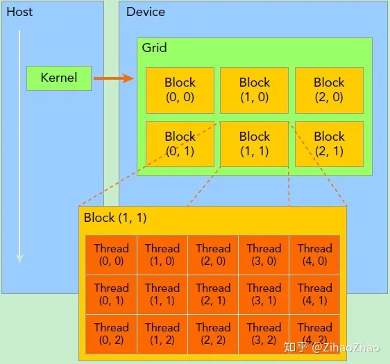

# CUDA
CUDA编程模型假设系统是由一个主机(CPU)和一个设备(GPU)组成的，而且各自拥有独立的内存。运行在设备上的代码，我们一般称之为核函数。核函数将由大量硬件线程并行执行。
在CUDA编程中，线程是一种层次结构来组织线程，层次包括：
- 线程网格(Grid)
- 线程块(Block)
- 线程束(Warp)
- 线程(Thread)

在CUDA编程中，内存也是通过层次结构来组织内存访问的。包括：
- 寄存器
- 共享内存
- 常量内存
- 全局内存

# 线程管理
## 线程组织方式


当核函数在主机端启动时，其执行会移动到设备上，此时设备中会产生大量的线程并且每个线程都执行由核函数指定的语句。
- 每个内核启动所产生的线程统称为一个网格(Grid),同一个网格中的所有线程共享相同的全局内存空间
- 一个网格由多个线程块(Block)组成。
- 一个线程块由一组线程(Thread)构成。
- Thread、Block 可以使用三维结构组织数据。

## 如何计算线程索引
使用怎样的线程布局是如何调用核函数，优化性能的一个很重要的方面。
对于核函数本身，我们需要关心当前的线程索引是多少，线程索引的计算方式为"左乘右加"具体如下：
- 从index 开始， 乘以坐下的dims元素
- 再加上同一行的 index, 最后得到线程索引
```python
    /*    dims                 indexs
            1                    1
        gridDim.z            blockIdx.z
        gridDim.y            blockIdx.y
        gridDim.x            blockIdx.x
        blockDim.z           threadIdx.z
        blockDim.y           threadIdx.y
        blockDim.x           threadIdx.x

        Pseudo code:
        position = 0
        for i in 6:
            position *= dims[i]
            position += indexs[i]
    */
```

比如：
```c
const int nthreads = 512;
int block_size = ndata < nthreads ? ndata : nthreads; 
int grid_size = (ndata + block_size - 1) / block_size; // 其含义是我需要多少个blocks可以处理完所有的任务
vector_add_kernel<<<grid_size, block_size, 0, nullptr>>>(a, b, c, ndata);
```

```python
/*    dims                 indexs
            0                               1
        gridDim.z=1                     blockIdx.z  = 0
        gridDim.y=1                     blockIdx.y  = 0
        gridDim.x=1                     blockIdx.x  = blockIdx.x
        blockDim.z=1                    threadIdx.z = 0
        blockDim.y=1                    threadIdx.y = 0
        blockDim.x=blockDim.x           threadIdx.x = threadIdx.x

        int idx = threadIdx.x + blockIdx.x * blockDim.x;

    */
```


